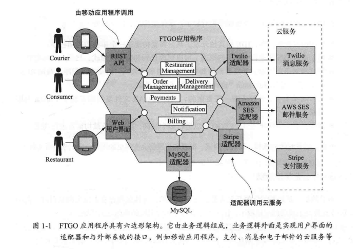
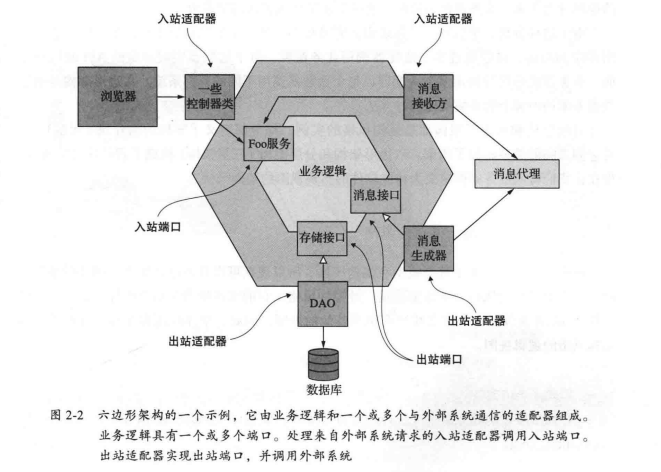
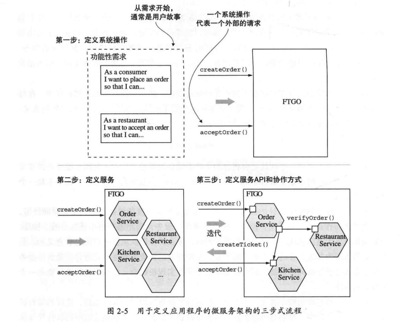

# 微服务架构设计模式

## 逃离单体地狱

1. 单体应用程序示例 (FTGO服务端架构图--其业务类似于美团)

   

   FTGO的核心业务其实非常简单。消费者(Consumer)使用FTGO的网站或者移动应用在本地的餐馆(Restaurant)下订单，FTGO会协调一个由送餐员(Courier)组成的快递网络来完成订单食品(Order)的运送(Delivery)。显然，给送餐员和餐馆支付费用(Payment)也是FTGO的重要任务之一。餐馆使用FTGO的网站编辑菜单并管理订单。这套应用程序使用了多个Web 服务，例如使用 Stripe 管理支付、使用Twilio 实现消息传递使用Amazon SES(Simple Email Service)发送电子邮件，等等。
   与其他陈旧的企业应用程序一样，FTGO 的应用程序是一个单体，它由一个单一的 Java WAR文件构成。随着时间的推移，这个文件变成了一个庞大的复杂的应用程序。尽管 FTGO开发团队做出了最大的努力，但这个应用程序已成为“泥球模式”的一个典型例子。泥球模式的作者Brian Foote 和Joseph Yoder 把这样的软件比喻为“随意架构的、庞大的、草率的、布满了胶带和线路，如同意大利面条一般的代码丛林”。软件交付的步伐已经放缓。更糟糕的是,FTGO应用程序是使用一些日益过时的框架编写的。FTGO应用程序展示了单体地狱的几乎所有症状。

2. 单体架构的好处

   * 应用的开发很简单:IDE 和其他开发工具只需要构建这一个单独的应用程序。
   * 易于对应用程序进行大规模的更改:可以更改代码和数据库模式，然后构建和部署
   * 测试相对简单直观:开发者只需要写几个端到端的测试，启动应用程序，调用 RESTAPI，然后使用Selenium这样的工具测试用户界面。
   * 部署简单明了:开发者唯一需要做的，就是把 WAR 文件复制到安装了 Tomcat 的服务器上。
   * 横向扩展不费吹灰之力:FTGO 可以运行多个实例，由一个负载均衡器进行调度

3. 单体架构导致的单体地狱

   

   * 过度的复杂性会吓退开发者

   * 开发速度缓慢

   * 从代码提交到实际部署的周期很长，而且容易出问题

     从代码完成到运行在生产环境是一个漫长且费力的过程。一个问题是，众多开发人员都向同一个代码库提交代码更改，这常常使得这个代码库的构建结果处于无法交付的状态。
     把更改推向生产环境的另一个挑战是运行测试需要很长时间。因为代码库如此复杂，以至于一个更改可能引起的影响是未知的，为了避免牵一发而动全身的后果，即使是一个微小的更改，开发人员也必须在持续集成服务器上运行所有的测试套件。系统的某些部分甚至还需要手工测试。如果测试失败，诊断和修复也需要更多的时间。因此，完成这样的测试往往需要数天甚至更长时间。

   * 难以扩展
     因为在有些情况下，应用的不同模块对资源的需求是相互冲突的。例如，餐馆数据保存在一个大型的内存数据库中，理想情况下运行这个应用的服务器应该有较大容量的内存。另外，图片处理模块又需要比较快的 CPU来完成图形运算，这需要应用部署在具有多个高性能CPU 的服务器之上。因为这些模块都是在一个应用程序内，因此FTGO在选用服务器时必须满足所有模块的需要

   * 交付可靠的单体应用是一项挑战
     系统不可靠的一个原因是应用程序体积庞大而无法进行全面和彻底的测试。缺乏可靠的测试意味着代码中的错误会进入生产环境。更糟糕的是，该应用程序缺乏故障隔离，因为所有模块都在同一个进程中运行。每隔一段时间，在一个模块中的代码错误，例如内存泄漏，将会导致应用程序的所有实例都崩溃。 

6. 扩展立方体

   
   
   X轴扩展是扩展单体应用程序的常用方法。在负载均衡器之后运行应用程序的多个实例。负载均衡器在 N个相同的实例之间分配请求。这是提高应用程序吞吐量和可用性的好方法。

   Z轴扩展也需要运行单体应用程序的多个实例，但不同于X轴扩展，每个实例仅负责数据的一个子集。图 1-5 展示了Z轴扩展的工作原理。置于前端的路由器使用请求中的特定属性将请求路由到适当的实例。例如，应用程序可能会使用请求中包含的 user Id 来路由请求。在这个例子中，每个应用程序实例负责一部分用户。该路由器使用请求 Authorization头部指定的user Id来从N个相同的应用程序实例中选择一个。对于应用程序需要处理增加的事务和数据量时，Z轴扩展是一种很好的扩展方式。

   X轴和Z轴扩展有效地提升了应用的吞吐量和可用性，然而这两种方式都没有解决日益增长的开发问题和应用复杂性。为了解决这些问题，我们需要采用Y轴扩展，也就是功能性分解。Y轴扩展把一个单体应用分成了一组服务，如图 1-6 所示。

   

   服务本质上是一个**麻雀虽小但五脏俱全的应用程序**，它实现了一组相关的功能，例如订单管理、客户管理等。服务可以在需要的时候借助X轴或Z轴方式进行扩展。例如，订单服务可以被部署为一组负载均衡的服务实例。
   我对微服务架构的概括性定义是: **把应用程序功能性分解为一组服务的架构风格。请注意这个定义中并没有包含任何与规模有关的内容。重要的是，每一个服务都是由一组专注的、内聚的功能职责组成。**

5. 微服务特点：

   * 拆分性(**模块化的一种形式**)：将一个大型应用程序拆分成多个小型服务，每个服务实现一个或多个相关的业务功能，有助于实现系统的松耦合和高内聚，方便开发、测试、部署和维护。
   * 可独立部署：每个微服务都可以独立进行开发、测试、部署和运行，具有较好的可维护性和可扩展性。
   * 去中心化：微服务架构**不依赖于中心化**的应用服务器或数据库，可以更好地支持分布式部署和扩展；通过消息机制来同步数据。
   * 面向服务：每个微服务都以服务的形式进行通信和交互，**可以使用不同的编程语言**、技术栈和工具进行开发和部署，有助于提高开发效率和系统灵活性
   * 健壮性和弹性：微服务架构可以更好地支持故障隔离和容错处理，有助于提高系统的健壮性和弹性。

   

6. 微服务架构与SOA的异同

   |              | SOA                                                         | 微服务                                         |
   | ------------ | ----------------------------------------------------------- | ---------------------------------------------- |
   | 技术栈       | 重量级技术，例如 SOAP 和其他类似的 WS* 标准                 | 轻量级、开源的技术，如 REST 或 g RPC 等协议    |
   | 服务通信方式 | 采用 **ESB 进行服务集成**，包含业务和消息处理逻辑的智能管道 | 使用哑管道（如消息代理）进行通信               |
   | 数据处理方式 | 有全局的数据模型，**共享数据库**                            | 每个服务有自己的数据库和领域模型               |
   | 服务规模     | 集成大型、复杂的单体应用程序                                | 通常比较小，应用由数十甚至上百个更小的服务组成 |
   | 主要优点     | 可复用性高                                                  | 粒度小、自治性高、弹性好                       |
   | 主要缺点     | 部署和维护复杂                                              | 跨服务事务管理复杂                             |

7. 微服务优点

   * 使大型的复杂应用程序可以持续交付和持续部署每个服务都相对较小并容易维护。

   * 服务可以独立部署。

   * 服务可以独立扩展。

     服务可以独立扩展，不论是采用X轴扩展的实例克隆，还是Z 轴扩展的流量分区方式此外，每个服务都可以部署在适合它们需求的硬件之上。这跟使用单体架构的部署和硬件选择是迥然不同的:单体应用中组件对硬件的需求不同(例如有些组件是 CPU 运算密集型的有些可能需要更多的内存空间)，但是这些组件仍旧必须被部署在一起。

   * 微服务架构可以实现团队的自治

   * 更容易实验和采纳新的技术。

   * 更好的容错性。

8. 微服务的弊端

   * 服务的拆分和定义是一项挑战。
   * 分布式系统带来的各种复杂性，使开发、测试和部署变得更困难。
   * 当部署跨越多个服务的功能时需要谨慎地协调更多开发团队。
   * 开发者需要思考到底应该在应用的什么阶段使用微服务架构。

9. 微服务架构并不是“银弹”
   早在1986年，《人月神话》(Addison-Wesley Professional，1995)的作者 Fred Brooks 就曾说:软件工程的世界里没有银弹。换一种说法，并不存在一种或几种技术，可以把你的生产效率提升10倍。

   **目前的设计模式以及框架并不能有效提高系统效率，甚至会降低效率；应选择适合现状的架构，不应过度迷恋新技术，导致过度设计，从而导致系统的维护成本变高。**

10. 模式

    描述解决一个特定问题的最佳实践或经验的通用形式。模式通常是一种抽象的、独立于具体实现的描述，它描述了一个通用的、可重复使用的解决方案，可以被应用到不同的具体场景中。模式通常包含了一组规则、约定、设计原则、代码实现等等，这些元素共同组成了一个完整的解决方案。

11. 模式语言

    一组相互关联的设计模式，它们共同构成一个更大的、综合性的设计思想或实践。模式语言通常包含了许多具体的设计模式，这些模式之间有着相互依赖和互补的关系，可以用来描述一个复杂的、大型的、具有复杂结构和相互作用的软件系统。模式语言的设计目的是为了让开发人员能够更好地理解和应对软件开发中的复杂性。

## 服务的拆分策略

1. 软件架构定义

   应用程序的架构是将软件分解为元素element)和这些元素之间的关系(relation)。由于以下两个原因，分解很重要:

   * 它促进了劳动和知识的分工。它使具有特定专业知识的人们(或多个团队)能够就应用程序高效地**协同工作**。
   * 它定义了软件元素的**交互方式**

2. 软件架构的4+1视图模型

   

   * 逻辑视图:开发人员创建的软件元素。在面向对象的语言中，这些元素是类和包。它们之间的关系是类和包之间的关系，包括继承、关联和依赖。
   * 实现视图:构建编译系统的输出。此视图由表示打包代码的模块和组件组成，组件是由一个或多个模块组成的可执行或可部署单元。在 Java 中，模块是JAR 文件，组件通常是 WAR 文件或可执行 JAR 文件。它们之间的关系包括模块之间的依赖关系以及组件和模块之间的组合关系。
   * 进程视图:运行时的组件。每个元素都是一个进程，进程之间的关系代表进程间通信。
   * 部署视图:进程如何映射到机器。此视图中的元素由(物理或虚拟)计算机和进程组成。机器之间的关系代表网络。该视图还描述了进程和机器之间的关系
   * 除了这四个视图以外，4+1中的 +1 是指场景，它负责把视图串联在一起。每个场景负责描述在一个视图中的多个架构元素如何协作，以完成一个请求。例如，在逻辑视图中的场景，展现了类是如何协作的。同样，在进程视图中的场景，展现了进程是如何协作的。

3. 逻辑视图的架构风格

   * 分层式

     表现层:包含实现用户界面或外部 API的代码业务。

     逻辑层:包含业务逻辑。

     数据持久化层:实现与数据库交互的逻辑。

   * 六边形

     六边形架构是分层架构风格的替代品。如图 2-2 所示，六边形架构风格选择以业务逻辑为中心的方式组织逻辑视图。应用程序具有一个或多个入站适配器，而不是表示层，它通过调用业务逻辑来处理来自外部的请求。同样，应用程序具有一个或多个出站适配器，而不是数据持久化层，这些出站适配器由业务逻辑调用并调用外部应用程序。此架构的一个关键特性和优点是业务逻辑不依赖于适配器。相反，各种适配器都依赖业务逻辑。

     

     由于这种分离，单独测试业务逻辑要容易得多。另一个好处是它更准确地反映了现代应用程序的架构。可以通过多个适配器调用业务逻辑，每个适配器实现特定的 API或用户界面。业务逻辑还可以调用多个适配器，每个适配器调用不同的外部系统。六边形架构是描述微服务架构中每个服务的架构的好方法。

4. 实现视图的架构风格

   * 单体架构

   * 微服务架构

     它的实现视图由多个组件构成:一组可执行文件或 WAR文件。它的组件是服务，连接器是使这些服务能够协作的通信协议。每个服务都有自己的逻辑视图架构，通常也是六边形架构。

5. 定义应用程序的微服务架构

   

   * 系统操作(system operation)是应用程序必须处理的请求的一种抽象描述。它既可以是更新数据的命令，也可以是检索数据的查询。每个命令的行为都是根据抽象领域模型定义的，抽象领域模型也是从需求中派生出来的。系统操作是描述服务之间协作方式的架构场景。

   * 该流程的第二步是确定如何分解服务。有几种策略可供选择。

     * 一种源于业务架构学派的策略是定义与业务能力相对应的服务。
     * 另一种策略是围绕领域驱动设计的子域来分解和设计服务。

     *但这些策略的最终结果都是围绕业务概念而非技术概念分解和设计的服务。*

   * 定义应用程序架构的第三步是确定每个服务的 API。为此，你将第一步中标识的每个系统操作分配给服务。服务可以完全独立地实现操作。或者，它可能需要与其他服务协作。在这种情况下，你可以确定服务的协作方式，这通常需要服务来支持其他操作。你还需要确定选用第3章中描述的哪种进程间通信机制来实现每个服务的API。

6. 拆分服务的指导原则

   * 单一职权原则
   * 闭包原则

7. 拆分服务的难点

   * 网络延迟。

   * 同步进程间通信导致可用性降低。

     如何处理进程间通信而不降低系统的可用性。例如，实现create Order()操作最常见的方式是让order Service 使用REST同步调用其他服务这样做的弊端是REST这样的协议会降低order Service 的可用性。如果任何一个被调用的服务处在不可用的状态，那么订单就无法创建了。有时候这可能是一个不得已的折中，但是在第 3 章中学习异步消息之后，你就会发现其实有更好的办法来消除这类同步调用产生的紧耦合并提升可用性。

   * 在服务之间维持数据一致性。

   * 获取一致的数据视图。

     分解的另一个障碍是无法跨多个数据库获得真正一致的数据视图。在单体应用程序中,ACID 事务的属性保证查询将返回数据库的一致视图。相反，在微服务架构中，即使每个服务的数据库是一致的，你也无法获得全局一致的数据视图。如果你需要一些数据的一致视图，那么它必须驻留在单个服务中，这也是服务分解所面临的问题。幸运的是，在实践中这很少带来真正的问题。

   * 上帝类阻碍了拆分

     上帝类通常为应用程序的许多不同方面实现业务逻辑。它有大量字段映射到具有许多列的数据库表。大多数应用程序至少有一个这样的上帝类，每个类代表一个对领域至关重要的概念:银行账户、电子商务订单、保险政策，等等。因为上帝类将应用程序的许多不同方面的状态和行为捆绑在一起，所以将使用它的任何业务逻辑拆分为服务往往都是一个不可逾越的障碍。

## 微服务架构中的进程间通信

## 使用Saga管理事务

## 微服务架构中的业务逻辑设计

## 使用时间溯源开发业务逻辑

## 在微服务架构中实现查询

## 外部API模式

## 微服务架构中的测试策略（上）

## 微服务架构中的测试策略（下）

## 开发面向生产环境的微服务应用

## 部署微服务应用

## 微服务架构的重构策略
