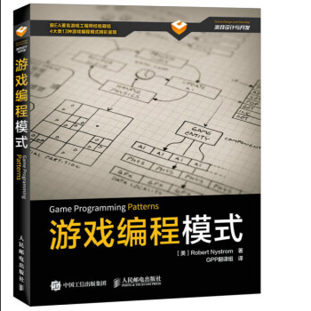
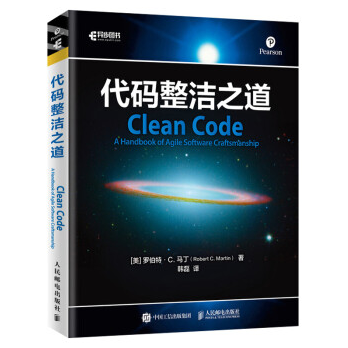
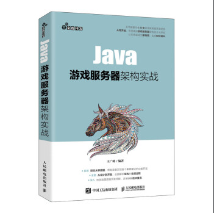
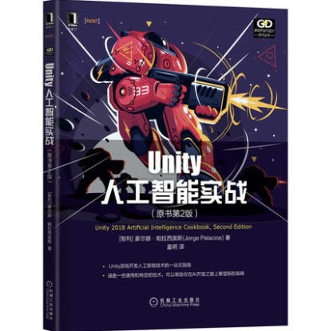
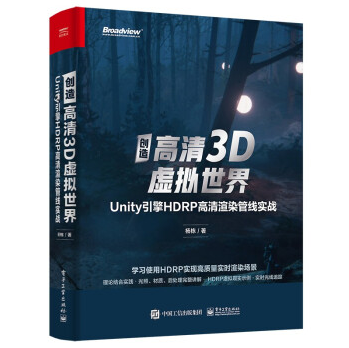
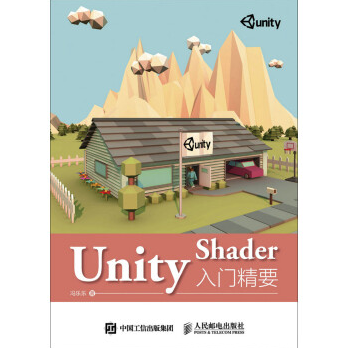
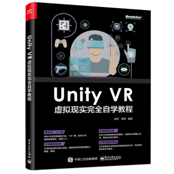
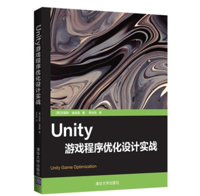
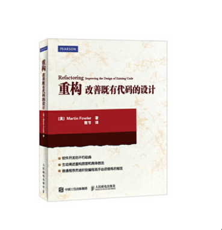

# Game Programmer Study Notes 游戏编程学习笔记 

# Game Programming Patterns 游戏编程模式

[代码示例](./GameProgrammingPatterns)	

- 重访设计模式
  - [命令模式](./GameProgrammingPatterns/Command.md)：*将“请求〞封装成对象，以便使用不同的清求，队列或者日志来参数化其他对象，同时支持可撤消的操作*
  - [享元模式](./GameProgrammingPatterns/Flyweight.md)：*以共享的方式高效地支持大量的细粒度的对象。通过复用内存中已存在的对象，降低系络创建对象实例的性能消耗*
  - [观察者模式](./GameProgrammingPatterns/Observer.md)：*定义对象间的一种一对多的依赖关系，当一个对象的状态发生改变时，所有依赖于它的对象都得到通知并被白动更新*
  - [原型模式](./GameProgrammingPatterns/Prototype.md)：*用原型实例指定创建对象的种类，并且通过拷贝这些原型创建新的对象*
  - [单例模式](./GameProgrammingPatterns/Singleton.md)：*保证一个类只有一个实例，并且提供了访问该实例的全局访问点*
  - [状态模式](./GameProgrammingPatterns/State.md)：*允许对象在当内部状态改交时改交其行为，就好像此对象改变了自己的类一样*
- 序列模式
  - [双缓冲模式](./GameProgrammingPatterns/DoubleBuffer.md)：*使用序列操作来模拟瞬间或者同时发生的事情*
  - [游戏循环](./GameProgrammingPatterns/Assets/SequencingPatterns/GameLoop)：*实现游戏运行过程中对用户输入处理和时间处理的解耦*
  - [更新方法](./GameProgrammingPatterns/UpdateMethod.md)：*通过每次处理一帧的行为来模拟一系列独立对象*
- 行为模式
  - [字节码](./GameProgrammingPatterns/Bytecode.md)：*将行为编码为虚拟机器上的指令，来赋予其数据的灵活性。从而让数据易于修改，易手加载，并与其他可执行部分相隔离*
  - [子类沙箱](./GameProgrammingPatterns/SubclassSandbox.md)：*用一系列由基类提供的操作定义子类中的行为*
  - [类型对象](./GameProgrammingPatterns/TypeObject.md)：*创造一个类A来允许灵活的创造新的类，而类A的每个实例都代表了不同类型的对象*
- 解耦模式
  - [组件模式](./GameProgrammingPatterns/Component.md)：*允许单一的实体跨越多个领域，无需这些领域彼此耦合*
  - [事件队列](./GameProgrammingPatterns/EventQueue.md)：*事件队列模式，对消息或事件的发送与处理进行时间上的解耦*
  - [服务定位器](./GameProgrammingPatterns/ServiceLocator.md)：*提供服务的全局接入点，而不心让用户和实现它的具体类解耦*
- 优化模式
  - [数据局部性](./GameProgrammingPatterns/DataLocality.md)：*合理组织数据，充分使用CPU的级存来加速内行读取*
  - [脏标识模式](./GameProgrammingPatterns/DirtyFlag.md)：*将工作延期至需要其结果时才去执行，以避免不心要的工作*
  - [对象池模式](./GameProgrammingPatterns/ObjectPool.md)：*放弃单独地分配和释放对象，从固定的池中重用对象，以提高性能和内存使用率*
  - [空间分区](./GameProgrammingPatterns/SpatialPartition.md)：*将对条存储在基于位置组织的数据结构中，来有效的定位对象*

**重访设计模式的六种设计方法为经典23种设计模式的之六，这六种设计模式也是游戏中常用的设计模式；序列模式、行为模式和优化模式适用与游戏引擎设计；解耦模式适用于游戏UI部分的设计-------自定义组件和消息机制的设计；是一本不错的学习游戏设计模式的书籍**

# QFramework Unity框架

[详细文档](./QFramework/README.md)

- 架构目的：使用框架的目的与意义
- 设计原则：SOLID设计模式的六大原则
- 总体架构：框架的分层以及层级之间的规则
- 代码示例：如何使用此框架
- 实现细节：框架实现过程中的技术要点

**此框架相较于流行的框架[ET](https://github.com/egametang/ET)、[JEngine](https://github.com/JasonXuDeveloper/JEngine)等框架，QFormwork更专注于逻辑层的架构，在工具层实现组件化做到即用即安装，更佳纯粹；此教程在Unity学堂可以学习，重点不应该放在框架的使用，而是放在框架的搭建过程**

# Unity 3D高级编程

* [第一章 架构](./ProfessionalUnity3D/第一章架构.md)：架构的意义、架构的原理以及如何实现架构
* [第二章 C#技术要点](./ProfessionalUnity3D/第二章技术要点.md)：C# 技术的基础知识
* [第三章 数据表与程序](./ProfessionalUnity3D/第三章数据表.md)：针对客户端中的表格数据、程序的协作与应用
* [第四章 用户界面](./ProfessionalUnity3D/第四章用户界面.md)：用户界面（UI）的工作原理与优化手段
* [第五章 3D模型与动画](./ProfessionalUnity3D/第五章3D模型与动画.md)：3D 模型的原理、动画的原理以及两者的优化
* [第六章 网络通信](./ProfessionalUnity3D/第六章网络层.md)：网络层的业务与底层原理
* [第七章 游戏中的AI](./ProfessionalUnity3D/第七章游戏中的AI.md) : 各种 AI 类型
* [第八章 地图与寻路](./ProfessionalUnity3D/第八章地图与寻路.md) ：场景构建与优化、地图构建以及寻路算法优化
* [第九章 渲染管线与图形学](./ProfessionalUnity3D/第九章渲染管线与图形学.md) ：图形数学、图形学常用算法、渲染管线的相关知识
* [第十章 渲染原理与知识](./ProfessionalUnity3D/第十章渲染原理与知识.md) ：客户端各类渲染技术的渲染原理

**整本书讲解的为Unity的底层原理，核心思想是优化游戏性能，主要的围绕提高游戏运行速度与降低内存消耗展开，优化的本质其实就是减少GC和降低drewcall，进而分别从C#技术要点、UI、模型等模块进行讲解，适合有一定Unity开发经验的学习者**

# Clean Code 

[详细文档](./CleanCode/CleanCode.md)

* 目的
* 命名法则
* 函数
* 注释
* 格式准则
* 对象和数据结构
* 错误处理
* 边界
* 单元测试
* 类

**本书主要讲解功能实现的时候代码的规范，如果你阅读的时候发现你都做到了，那你写的代码一定十分简洁，当然大多数的人应该或多或少都会有些点没有做到，那这就是你代码的提高点，此书可以多次阅读，每次尽可能都有一点改善就好，如果对书中的优化点你存在异议，请相信“Bob大叔”**

# 游戏感

[详细文档](./GameFell/GameFell.md)

* 游戏感的三大基础构件
  * 实时控制
  * 模拟空间
  * 润色 (Polish)
* 游戏感的体验
  * 操作的美感
  * 学习、练习和掌握一项技能的榆
  * 悦感
  * 感觉的延伸
  * 个体的延伸
  * 与游戏里一个独特的物理实体的
  * 交互感
* 创造游戏感
* 游戏感测量维度
  * 输入
  * 响应
  * 情景
  * 润色
  * 隐喻
  * 规则

**本书主要讲解游戏感的定义、游戏感的三大基础构件以及度量游戏感的六个维度，使得我们可以从数据上对游戏好坏进行评判，评判游戏变得可以量化**

# Java 游戏服务器架构实战

[详细文档](./JavaGameServerArchitectureOfActualCombat/README.md)

* 模块零概论
  * 第1章 游戏服务器架构总体设计
  * 第2章 服务器项目管理一Maven
  * 第3章 数据库选择与安装
* 模块二 游戏服务中心架构设计
  * 第4章 游戏服务中心开发
  * 第5章 Web服务器网关开发
* 模块三 游戏网关架构设计
  * 第6章 游戏服务器网关开发
  * 第7章 游戏服务器网关与游戏业务服务数据通信
* 模块四 业务服务架构设计
  * 第8章 游戏业务处理框架开发
  * 第9章 游戏用户数据管理
* 模块五 RPC通信架构设计
  * 第10章 RPC 通信设计与实现
  * 第11章 事件系统的设计与实现
  * 第12章 游戏服务器自动化测试
* 模块六 实例
  * 第13章 服务器开发实例一一世界聊天系统

**本书主要从游戏服务中心、游戏网关、RPC通信和业务服务四个模块，展开介绍游戏的短链接和长链接的网关设计、以及微服务通信以及业务服务设计实现，其中主要是用的框架为Spring Cloud**

# Unity 人工智能实战

[详细文档](./UnityAI/README.md)

* 第1章 行为一一智能移动
* 第2章 导航
* 第3章 决策制定
* 第4章 新的NavMesh API
* 第5章 协作和战术
* 第6章 agent感知
* 第7章 棋类游戏和应用的搜索AI
* 第8章 机器学习
* 第9章 程序化内容生成
* 第10章 其他

**本书主要讲解如何实现各类游戏AI，在实现Agent寻路时重点讲解了NavMesh使用，并在最后两章讲解了主流的几个智能体的实现**

# Unity引擎HDRP高清渲染管线实战

[详细文档](./UnityHDRP/README.md) 

* 第1章　HDRP入门.
* 第2章　实现市政厅办公室场景
* 第3章　HDRP配置文件和Volume框架详解
* 第4章　HDRP光照系统详解
* 第5章　Lightmapping（光照烘焙）详解
* 第6章　HDRP材质详解
* 第7章　Post.Processing后处理详解
* 第8章　HDRP.Debug窗口介绍
* 第9章　HDRP在VR中的应用
* 第10章　HDRP.Custom.Pass应用
* 第11章　HDRP实时光线追踪项目应用

**本书主要讲解Unity的HDRP渲染管线的使用，推荐地编阅读一下，有助于理解Unity的灯光系统与渲染。**

# Unity网络游戏实战

[详细文档](./UnityNetworkGame/README.md)

* 第一章 网络游戏的开端
* 第二章 分身有术：异步和安路复用
* 第三章 文践出真知：大乱斗游戏
* 第四章 正砷收发数据流
* 第五章 深入了解TCP，解决暗藏问题
* 第六章 通用客户端网络模块
* 第七章 通用服务端框架
* 第八章 完整大项目《坦克克大战》
* 第九章 UI界面模块
* 第十章 游戏大厅和房间
* 第十一章 战斗和胜负判定
* 第十二章 同步战斗信息

**第一部分“扎基础”主要介绍TCP网络游戏开发的必备知识，包括TCP异步连接、多路复用的处理，以及怎样处理粘包分包、怎样发送完整的网络数据、怎样设置正确的网络参数。第3章介绍了一款简单 网络游戏开发的全过程，在后续章节中会逐步完善这个游戏。** 

**第二部分“搭框架”主要介绍商业级客户端网络框架的实现方 法。这套框架具有较高的通用性，解决了网络游戏开发中常遇到的问 题，且达到极致的性能要求，可以运用在多款游戏上。书中还介绍了 一套单进程服务端框架的实现，服务端框架使用select多路复用，做到底层与逻辑分离，设有消息分发、事件处理等模块。 第**

**三部分“做游戏”通过一个完整的实例讲解网络游戏的设计思路，包括游戏实体的类设计、怎样组织代码、怎样实现游戏大厅（房间系统）、怎样实现角色的同步。这一部分会使用第二部分搭好的框架，一步步地做出完整的游戏项目。**

# Unity Shader入门精要

[详细文档](./UnityShader/README.md)

1. 第1篇　基础篇
   * 第1章　欢迎来到Shader的世界
   * 第2章　渲染流水线
   * 第3章　Unity Shader基础
   * 第4章　学习Shader所需的数学基础

2. 第2篇　初级篇
   * 第5章　开始Unity Shader学习之旅
   * 第6章　Unity中的基础光照
   * 第7章　基础纹理
   * 第8章　透明效果

3. 第3篇　中级篇
   * 第9章　更复杂的光照
   * 第10章　高级纹理
   * 第11章　让画面动起来
4. 第4篇　高级篇
   * 第12章　屏幕后处理效果　
   * 第13章　使用深度和法线纹理
   * 第14章　非真实感渲染
   * 第15章　使用噪声
   * 第16章　Unity中的渲染优化技术
5. 第5篇　扩展篇
   * 第17章　Unity的表面着色器探
   * 第18章　基于物理的渲染
   * 第19章　Unity 5更新了什么
   * 第20章　还有更多内容吗　

**本书主要介绍Unity Shader原理、如何编写出自己想要的shader；虽然Unity2020开始主推SRP，shader可以使用Shader Graph进行快速的制作，但是其基本原理还是大同小异，Shader Graph只是降低制作shader的门槛，使开发不再纠结于ShaderLab这门语言，但是这本书很大一部分在讲解Unity的渲染原理，这部分是Unity开发非常值得学习的**

# Unity VR虚拟现实完全自学教程

[详细文档](./UnityVR/README.md)

* 第1章：对VR行业进行了概述，介绍了该技术在其他行业中的应用案例，以及目前VR行业面临的挑战
* 第2章：对 Unity 编辑器进行了介绍。
* 第3章：对主流硬件设备及分类进行了介绍，使读者对当前主流 VR 硬件平台有了初步认知。
* 第4章：介绍了 VR 应用程序制作的基本工作流程和一些常用的开发工具。
* 第5章：介绍了在 VR 应用程序中需要遵循的交互设计原则。
* 第6章：介绍了 HTC VIVE 硬件的基本结构、安装步骤、实现位置追踪的原理，并对作为主要交互设备的控制器的按键进行了说明。
* 第7章：介绍了 VR中的U技术，讲解了在 Unity 中如何将UI 元素设置为能够在 VR环境中呈现的方法。
* 第8章：笔者从接触的学员作品来看，大部分 VR 应用程序只聚焦于交互的实现，忽视了作品的呈现品质，而这恰是 VR 应用程序给用户的第一印象。本章介绍了基于物理的渲染理论 (PBR),以及常用的 PBR 材质制作软件，通过实例介绍了 Substance Painter 的使用方法，目的是为了强调写实材质在 VR 应用程序中的关键地位。
* 第9章：SteamVR 是进行 PC 平台 VR 应用程序开发的重要工具，本章通过实例介绍了 SteamVR以及基于其上的 InteractionSystem 的核心模块和基本使用方法。
* 第10章：VRTK 是基于 SteamVR 进行 VR 应用程序开发的重要插件，本章详细介绍了 VRTK的使用方法，通过一系列实例，讲解了该插件在 VR 交互开发工作中的高效性。
* 第 11 章：VR 平合与PC、移动平台最大的区别在于交互方式的不同，本章通过演示将 PC平台上的一款游戏移植到 VR 平台的过程，展示交互开发在 VR 平台上的重要性。
* 第12章：介绍了手势识别设备---Lcap Motion 在 VR中的应用，通过一个器械装配实例，讲解了如何在 VR 中通过手势实现与物体的交互。
* 第13章：介绍了 VIVE 追踪器（Tracker）的基本使用方法，通过实例讲解了如何实现在 VR环境中将追踪器与现实世界物体进行鄉定并跟踪其位置。
* 第 14 章：演示了类似 VR 游戏《水果忍者 VR》的原型项目开发，包括游戏逻辑、水果生成、切割效果、计分 U 呈现等功能模块。
* 第15 章：演示了类似VR 应用程序 Tilt Brush 的原型项目开发，包括在 VR 环境中使用控制器绘制线条、 修改画笔颜色等功能模块。
* 第16 章：介绍了 Unity 编辑器内置的性能优化工具，同时针对 Unity 讲解了几种应用程序的优化原则。

**本书主要讲解VR的发展史、现状以及如何搭建VR项目，测试过将现有项目转Oculus、Pico 3以及Huawei VR，其本质就是替换Camera和输入设备仅此而已。**

# Unity 游戏程序优化设计实战

[详细文档](./UnityGameOptimization/README.md)

* 第1章 检测性能问题
* 第2章 脚本编写策略
* 第3章 批处理的好处
* 第4章 快速启动艺术资产
  * 音频
  * 纹理文件
  * 网格和动画文件
* 第5章 更快的物理引擎
* 第6章 动态图形
  * 前端瓶颈 CPU
  * 后端瓶颈GPU
  * 照明和阴影

* 第7章 精通内存管理

**本书侧重于讲解优化的方法，主要分了对内存、GPU、CPU等几个方面，但是由于这是第一版，书中是基于Unity5进行讲解的，并不适用于Unity 2022，不过其基本的理念是相通的，但是对很多基础的知识讲解，并没有《Unity3D高级编程》一书中详细，不过作者作为一个非科班出身的人，对游戏引擎研究到如此程度，已经着实不易。**

# 重构 改善既有代码的设计

# 百万在线---大型游戏服务端开发

[详细文档](./BigGameServerDevelopment/README.md)

* 第一部分　学以致用
  * 第1章　从角色走路说起
  * 第2章　Skynet入门精要
  
  * 第3章　案例：《球球大作战》
  
  * 第4章　Skynet进阶技法
  
* 第二部分　入木三分
  * 第5章　你好，C++并发世界

  * 第6章　图解TCP网络模块

  * 第7章　嵌入Lua脚本语言

* 第三部分　各个击破
  * 第8章　同步算法

  * 第9章　热更新

  * 第10章　防外挂

  * 第11章　未尽之路
    * 11.1　高并发

    * 11.2　服务端架构

    * 11.3　工程管理

**本书主要讲解游戏服务器如何构建，可以结合作者的《Unity3D网络实战(第二版)》一起来看，此书的受众应该为游戏服务开发人员或者是高级游戏开发者；本书的讲解了Skynet的使用、仿写Skynet以及游戏服务器常见的问题，例如同步算法和热更新；Skynet虽然是一套老的服务器框架，但是能沿用至今也是有其优点的；例如：高性能、易用、可扩展。**

**本书推荐阅读，此书作者用心程度和《Unity 3D高级编程》一致，引用一下作者的结束语 “愿我们的游戏能像一束光，突破黑暗，穿越时间，触动玩家的灵魂”。**

# 游戏服务器架构与优化

[详细文档](./TheGameServerArchitectureAndOptimization/README.md)

* 第一部分　网络和服务器
  * 第1章　Python网络编程模块 
  * 第2章　通信加密
  * 第3章　服务器实作
* 第二部分　存储与数据库
  * 第4章　基础内容存储 
  * 第5章　存储方案
* 第三部分　服务器架构及其方案
  * 第6章　游戏服务器初探
  * 第7章　游戏服务器的交互
  * 第8章　游戏大厅
  * 第9章　实时交互服务器
  * 第10章　天梯和经济系统
  * 第11章　服务器承载量和客户端优化方案
  * 第12章　分布式服务器

# 微服务架构设计模式

[详细文档](./MicroservicesPatterns/README.md)

1. 逃离单体地狱
2. 服务的拆分策略
3. 微服务架构中的进程间通信
4. 使用Saga管理事务
5. 微服务架构中的业务逻辑设计
6. 使用时间溯源开发业务逻辑
7. 在微服务架构中实现查询
8. 外部API模式
9. 微服务架构中的测试策略（上）
10. 微服务架构中的测试策略（下）
11. 开发面向生产环境的微服务应用
12. 部署微服务应用
13. 微服务架构的重构策略

# 腾讯游戏开发精粹 Ⅱ

[详细文档](./TencentGameDevelopment2/README.md)

* 部分Ⅰ 人工智能
  * 第1章 基于照片的角色捏脸和个性化技术 
  * 第2章 强化学习在游戏AI中的应用
  * 第3章 多种机器学习方法在赛车AI中的综合应用
  * 第4章 数字人级别的语音驱动面部动画生成
* 部分Ⅱ 计算机图形
  * 第5章 实时面光源渲染
  * 第6章 可定制的快速自动化全局光照和可见性烘焙器
  * 第7章 物质点法在动画特效中的应用
  * 第8章 高自由度捏脸的表情动画复用方案
* 部分Ⅲ 动画和物理
  * 第9章 多足机甲运动控制解决方案
  * 第10章 物理查询介绍及玩法应用
  * 第11章 基于物理的角色翻越攀爬通用解决方
* 部分Ⅳ 客户端架构和技术
  * 第12章 跨游戏引擎的H5渲染解决方案
  * 第13章 大世界的场景复杂度管理方案
  * 第14章 基于多级细节网格的场景动态加载
* 部分Ⅴ 服务端架构和技术
  * 第15章 面向游戏的高性能服务网格TbusppMesh
  * 第16章 游戏配置系统设计
  * 第17章 游戏敏捷运营体系技术
* 部分Ⅵ 管线和工具
  * 第18章 从照片到模型
  * 第19章 一种可定制的Lua代码编辑检测工具
  * 第20章 安卓平台非托管内存分析方案
  * 第21章 过程化河流生成方法研究与应用
